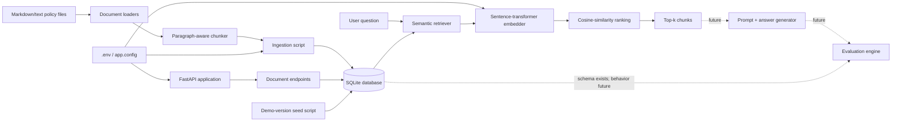
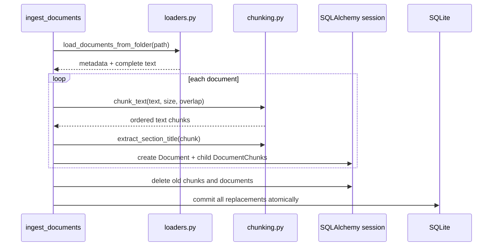
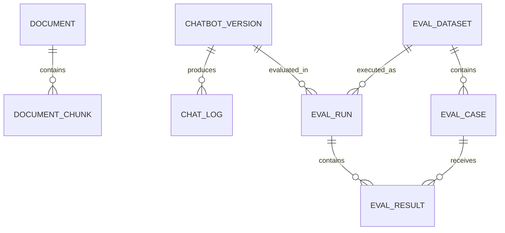

# EvalForge Technical Guide

This document explains the current EvalForge codebase from the outside in. It is
both a project reference and an interview-preparation guide.

## 1. Executive summary

EvalForge is being built as a quality-assurance platform for retrieval-augmented
generation (RAG) chatbots. The final product is intended to compare chatbot
versions, run evaluation datasets, score answers, classify failures, and expose
the results through APIs and a dashboard.

The current repository implements the foundation and retrieval half of that
vision:

- a FastAPI backend;
- environment-based configuration;
- a SQLite database accessed through SQLAlchemy;
- a seven-document fictional company-policy corpus;
- Markdown and text document loading;
- paragraph-aware text chunking with bounded overlap;
- repeatable database ingestion;
- read-only document APIs;
- sentence-transformer embeddings;
- in-memory cosine-similarity retrieval;
- four seeded chatbot configurations;
- 50 automated tests.

The current implementation corresponds to Steps 1 through 11 of the roadmap in
`Instructions.md`. The database already contains models for later evaluation
features, but prompts, answer generation, a complete RAG pipeline, chat APIs,
evaluation metrics, evaluation execution, a dashboard, and reports have not yet
been implemented.

### Verified state on June 22, 2026

The current local database contains:

| Entity | Count |
|---|---:|
| Documents | 7 |
| Document chunks | 27 |
| Chatbot versions | 4 |
| Chat logs | 0 |
| Evaluation datasets | 0 |
| Evaluation cases | 0 |
| Evaluation runs | 0 |
| Evaluation results | 0 |

The full test suite passes: **50 passed** on Python 3.13.14.

## 2. The problem the project is designed to solve

A normal RAG chatbot retrieves source material and gives that material to a
language model. A working demo is not enough for production: a team also needs
to know whether answers are grounded, whether citations are present, whether
the system refuses unanswerable questions, and whether a new configuration is
better or worse than the previous one.

EvalForge is intended to make those qualities measurable. Its planned loop is:

1. ingest source documents;
2. define multiple chatbot configurations;
3. run the same evaluation questions against each configuration;
4. inspect retrieval and generated answers;
5. calculate deterministic metrics;
6. classify failures;
7. compare versions and detect regressions.

At present, steps 1 and 2 are operational, and the retrieval component needed
by step 3 is operational. Generation and evaluation are the next major layers.

## 3. Architecture at a glance



The two implemented runtime paths are:

- **ingestion path:** files → loader → chunker → SQLAlchemy models → SQLite;
- **retrieval path:** question + stored chunks → embeddings → cosine scores →
  sorted top-k results.

The FastAPI layer currently exposes document data but does not yet expose
retrieval or chat as HTTP endpoints.

## 4. Repository map

```text
RAG QA/
├── app/
│   ├── main.py                    FastAPI application and health endpoint
│   ├── config.py                  Environment-based settings
│   ├── api/
│   │   └── documents.py           Read-only document endpoints
│   ├── db/
│   │   ├── database.py            Engine, sessions, table creation
│   │   ├── models.py              Eight SQLAlchemy models
│   │   └── schemas.py             Pydantic API response models
│   ├── ingestion/
│   │   ├── loaders.py             UTF-8 Markdown/text loading
│   │   ├── chunking.py            Paragraph-aware bounded chunking
│   │   └── embeddings.py          Model loading and vector utilities
│   └── rag/
│       └── retriever.py           Semantic top-k retrieval
├── data/
│   └── sample_company_policy/     Seven fictional policy documents
├── scripts/
│   ├── inspect_documents.py       Inspect files without changing the DB
│   ├── ingest_documents.py        Replace and ingest the demo corpus
│   └── create_demo_versions.py    Upsert four chatbot configurations
├── tests/                         50 unit/integration-style tests
├── .env.example                   Supported environment variables
├── requirements.txt               Pinned Python dependencies
├── pytest.ini                     Pytest configuration
├── README.md                      Setup and current-feature overview
└── Instructions.md                Full 34-step MVP roadmap
```

The `__init__.py` files mark folders as importable Python packages. They do not
currently contain runtime logic.

## 5. End-to-end workflows

### 5.1 API startup

1. Uvicorn imports `app.main:app`.
2. Importing `app.config` loads `.env` values.
3. Importing `app.db.database` creates the SQLAlchemy engine and session factory.
4. FastAPI starts its `lifespan` context manager.
5. `create_database_tables()` imports all models and runs
   `Base.metadata.create_all`.
6. Missing tables are created. Existing tables and data are left intact.
7. FastAPI begins serving `/health`, `/documents`, and the automatic docs.
8. When the server stops, execution continues after `yield`; there is currently
   no shutdown cleanup because no long-lived resource requires it.

### 5.2 Document ingestion



Detailed behavior:

1. The default source folder is
   `DATA_DIR/sample_company_policy`.
2. Supported `.md` and `.txt` files are loaded alphabetically.
3. Each complete document is split into bounded chunks.
4. A `Document` ORM object is created with status `ready`.
5. `DocumentChunk` children are appended through the ORM relationship.
6. Existing demo chunks are deleted before documents because chunks contain the
   foreign key.
7. One commit applies the whole replacement.
8. Any exception triggers a rollback, preventing a half-ingested corpus.
9. The session is always closed.

This strategy is intentionally simple and repeatable. Running ingestion twice
does not duplicate the corpus.

### 5.3 Semantic retrieval

1. `retrieve_chunks` validates the question and `top_k`.
2. It queries every stored chunk together with its parent filename.
3. The database session closes after the rows have been materialized.
4. If there are no chunks, it returns immediately without loading the embedding
   model.
5. The question and every chunk are embedded in one batch.
6. The first vector is treated as the question vector.
7. Cosine similarity is computed between the question and each chunk.
8. Results are sorted by descending score.
9. Equal scores are resolved deterministically by ascending chunk ID.
10. Only the first `top_k` results are returned.

The algorithm is straightforward but currently costs approximately `O(N)` model
work and `O(N log N)` sorting work for `N` stored chunks on every query.

### 5.4 Document API request

1. FastAPI resolves the `get_db` dependency.
2. `get_db` opens a SQLAlchemy session.
3. The endpoint executes a `select` or primary-key lookup.
4. An ORM object is returned.
5. Pydantic converts the ORM attributes into the declared response schema.
6. FastAPI serializes the result as JSON.
7. The dependency's `finally` block closes the session.

### 5.5 Demo chatbot version seeding

The seed script treats the version name as the stable identity:

- if a version does not exist, it is inserted;
- if it exists, every configured field is reset to the source-of-truth value;
- all changes are committed together;
- failures are rolled back.

This is an **idempotent upsert-like seed**, although it is implemented with a
select followed by insert/update rather than a database-native upsert.

## 6. Configuration

All settings are defined in `app/config.py` and read at import time.

| Variable | Default | Current purpose |
|---|---|---|
| `APP_NAME` | `EvalForge` | FastAPI title |
| `DATABASE_URL` | `sqlite:///./evalforge.db` | SQLAlchemy connection |
| `DATA_DIR` | `data` | Default corpus root |
| `DEFAULT_CHUNK_SIZE` | `500` | Maximum chunk characters |
| `DEFAULT_CHUNK_OVERLAP` | `100` | Desired prior context |
| `DEFAULT_EMBEDDING_MODEL` | `sentence-transformers/all-MiniLM-L6-v2` | Embedding model |
| `USE_MOCK_LLM` | `true` | Reserved for the future generator |

`python-dotenv` loads `.env`, but existing operating-system variables have
priority. Integer settings are converted immediately with `int`, so invalid
values fail fast during import.

`get_bool_env` accepts `1`, `true`, `yes`, and `on`, case-insensitively, as true.
Any other present value is false.

Important interview point: configuration values are module constants rather
than a Pydantic settings object. This is simple and appropriate for the current
size, though a larger application might use `pydantic-settings`, validation,
and dependency-injected settings.

## 7. Database design

### 7.1 Entity relationships



Only `Document`, `DocumentChunk`, and `ChatbotVersion` currently have populated
records. The other tables establish the data model for future stages.

### 7.2 Database infrastructure

#### `Base`

`Base` inherits from SQLAlchemy's `DeclarativeBase`. Every ORM model inherits
from it, which places each table in the same metadata registry.

#### `engine`

The engine is the shared database connection factory. For SQLite,
`check_same_thread=False` allows connections to be used safely across FastAPI's
request-handling threads.

#### SQLite foreign-key event

SQLite does not reliably enforce foreign keys unless the connection enables
them. The `Engine` connect listener executes:

```sql
PRAGMA foreign_keys=ON
```

for every new SQLite connection. A dedicated test verifies this behavior.

#### `SessionLocal`

`SessionLocal` is a configured SQLAlchemy `sessionmaker`. `autoflush=False`
prevents implicit flushes before queries, and `autocommit=False` makes
transaction boundaries explicit.

### 7.3 Table-by-table meaning

#### `documents`

One row represents one ingested source file.

| Field | Meaning |
|---|---|
| `id` | Primary key |
| `filename` | Unique indexed filename |
| `document_type` | `md` or `txt` |
| `source_path` | Original filesystem path |
| `status` | Ingestion state; currently written as `ready` |
| `num_chunks` | Denormalized chunk count |
| `created_at` | UTC creation timestamp |

Deleting a `Document` through its ORM relationship cascades to its chunks with
`delete-orphan`.

#### `document_chunks`

One row represents one ordered, searchable portion of a document.

| Field | Meaning |
|---|---|
| `document_id` | Parent document foreign key |
| `chunk_index` | Position inside the original document, starting at 0 |
| `chunk_text` | Searchable text |
| `section_title` | First Markdown heading found in the chunk |
| `page_number` | Reserved for formats such as PDF; currently null |

Embeddings are deliberately not stored. They are recomputed during retrieval.

#### `chatbot_versions`

A row is a named RAG/generation configuration. It records model, embedding,
chunking, retrieval, temperature, and prompt settings so versions can later be
compared reproducibly.

At present, the rows are seeded but are not yet consumed by a complete RAG
pipeline.

#### `chat_logs`

Designed to store one question/answer interaction, including the version used,
retrieved chunk IDs, latency, and timestamp. `retrieved_chunk_ids` is currently
modeled as JSON text for simplicity.

#### `eval_datasets`

Designed to group evaluation cases for a domain.

#### `eval_cases`

Designed to store a question, expected behavior, expected source chunks,
question type, difficulty, and whether the question should be answerable.

#### `eval_runs`

Designed to represent one execution of one dataset against one chatbot version.
It can track pending/completed state and an aggregate score.

#### `eval_results`

Designed to hold one case's generated answer, retrieved evidence, individual
metric values, hallucination flag, pass/fail outcome, and classified failure.

### 7.4 Timestamp handling

`utc_now()` returns an aware UTC `datetime` and is passed as a callable default.
Passing the function rather than calling it during model declaration ensures a
fresh timestamp is generated for every new row.

## 8. Module and function reference

### 8.1 `app/config.py`

#### `get_bool_env(name, default)`

Reads an environment variable and converts common true strings to `True`. If
the variable does not exist, it returns the supplied default.

The remaining module-level statements create the configuration constants used
throughout the application.

### 8.2 `app/main.py`

#### `lifespan(app)`

An asynchronous context manager registered with FastAPI. It creates missing
database tables before requests are accepted. The parameter is intentionally
unused because startup currently needs no application instance state.

#### `app`

The FastAPI application object. It sets title, description, version `0.1.0`,
lifespan behavior, and registers the document router.

#### `health_check()`

Handles `GET /health` and returns a fixed service-health payload. It confirms
that routing and the application process are alive; it does not currently probe
the database or embedding model.

### 8.3 `app/db/database.py`

#### `Base`

Shared declarative parent for all ORM models.

#### `enable_sqlite_foreign_keys(dbapi_connection, _)`

Runs whenever SQLAlchemy opens a SQLite connection and enables foreign-key
enforcement for that connection.

#### `get_db()`

A generator dependency for FastAPI. It yields one session and closes it in a
`finally` block, including when endpoint logic raises an exception.

#### `create_database_tables()`

Imports `app.db.models` so all classes are registered, then calls
`Base.metadata.create_all`. This creates missing tables but is not a migration
system and cannot safely evolve arbitrary existing schemas.

### 8.4 `app/db/models.py`

#### `utc_now()`

Produces an aware UTC timestamp for model defaults.

#### `Document`

ORM representation of a source file and parent of `DocumentChunk`.

#### `DocumentChunk`

ORM representation of an ordered, searchable text segment.

#### `ChatbotVersion`

ORM representation of a reproducible chatbot configuration.

#### `ChatLog`

Future ORM representation of one chatbot interaction.

#### `EvalDataset`

Future ORM representation of an evaluation collection.

#### `EvalCase`

Future ORM representation of one expected chatbot behavior.

#### `EvalRun`

Future ORM representation of one dataset-versus-version execution.

#### `EvalResult`

Future ORM representation of metrics and failure details for one case.

### 8.5 `app/db/schemas.py`

#### `DocumentResponse`

The public API shape for document metadata. `from_attributes=True` allows
Pydantic to read fields directly from SQLAlchemy objects.

#### `DocumentChunkResponse`

The public API shape for chunk content and metadata. It intentionally does not
nest the full parent document.

Separating schemas from ORM models keeps persistence details from automatically
becoming part of the public API.

### 8.6 `app/api/documents.py`

#### `router`

An `APIRouter` with `/documents` prefix and `Documents` OpenAPI tag.

#### `DatabaseSession`

An `Annotated` type alias combining SQLAlchemy's `Session` type with FastAPI's
`Depends(get_db)`. It reduces repetition in endpoint signatures.

#### `list_documents(database_session)`

Handles `GET /documents`. It selects all documents ordered alphabetically by
filename and returns a concrete list.

#### `get_document(document_id, database_session)`

Handles `GET /documents/{document_id}`. It uses SQLAlchemy's primary-key
`Session.get` and raises HTTP 404 with `Document not found` when absent.

#### `list_document_chunks(document_id, database_session)`

Handles `GET /documents/{document_id}/chunks`. It first verifies that the parent
document exists, then selects chunks ordered by `chunk_index`, preserving source
order.

### 8.7 `app/ingestion/loaders.py`

#### `SUPPORTED_EXTENSIONS`

The allowlist `{".md", ".txt"}`. Unsupported files are ignored by folder
loading.

#### `load_text_file(path)`

Converts the input to `Path`, checks that it is a file, and reads its complete
contents as UTF-8. Missing paths produce a descriptive `FileNotFoundError`.

#### `load_markdown_file(path)`

Checks that the suffix is `.md`, case-insensitively, then delegates actual
reading to `load_text_file`. A non-Markdown path raises `ValueError`.

#### `load_documents_from_folder(folder_path)`

Validates the folder, iterates direct children alphabetically, ignores
subdirectories and unsupported extensions, loads supported files, and returns
dictionaries containing:

```python
{
    "filename": "...",
    "source_path": "...",
    "document_type": "md or txt",
    "text": "complete source text",
}
```

It is deliberately non-recursive.

### 8.8 `app/ingestion/chunking.py`

#### Constants

- `PARAGRAPH_SEPARATOR` recognizes blank lines, including blank lines containing
  whitespace.
- `HEADING_PATTERN` recognizes Markdown headings from level 1 through level 6.

#### `extract_section_title(text_chunk)`

Searches the entire chunk for the first Markdown heading and returns only its
title text. It returns `None` when no heading exists.

#### `_split_long_paragraph(paragraph, chunk_size)`

Splits a paragraph that cannot fit into one chunk:

1. split into words;
2. pack words while respecting the character limit;
3. if one individual token is longer than the limit, slice that token into
   fixed-size pieces;
4. preserve every word or token fragment.

This function avoids silently losing repeated or oversized content.

#### `_prepare_paragraphs(text, chunk_size)`

Trims the document, splits it on blank lines, removes empty pieces, and sends
only oversized paragraphs to `_split_long_paragraph`.

#### `_build_base_chunks(paragraphs, chunk_size)`

Greedily packs prepared paragraphs into chunks separated by two newlines. Every
prepared paragraph appears exactly once in these base chunks.

#### `_take_overlap_suffix(text, maximum_length)`

Takes up to the requested number of trailing characters from the previous base
chunk. If truncation is required, it advances to the first whitespace so the
returned overlap does not start with a partial word. If no safe boundary exists,
it returns an empty string.

#### `_add_overlap(base_chunks, chunk_size, overlap)`

Prefixes each chunk after the first with readable trailing context from the
previous base chunk. It calculates the receiving chunk's spare capacity first,
so overlap never causes the final chunk to exceed `chunk_size`.

This is best-effort overlap: a nearly full receiving chunk may get less overlap
than requested or none at all.

#### `chunk_text(text, chunk_size=500, overlap=100)`

The public orchestration function. It validates:

- chunk size must be positive;
- overlap cannot be negative;
- overlap must be smaller than chunk size.

Blank text returns an empty list. Valid text moves through preparation, base
packing, and overlap addition.

Important nuance: the limit is measured in Python characters, not tokens. Model
token counts can therefore vary even when character counts are bounded.

### 8.9 `app/ingestion/embeddings.py`

#### `get_embedding_model()`

Imports `SentenceTransformer` lazily and initializes the configured model.
`@lru_cache(maxsize=1)` means the model is loaded only once per Python process.
The lazy import also lets modules and tests load without immediately importing
the heavy model stack.

The first real call may contact Hugging Face and download model files. In the
current restricted environment, a live retrieval attempt could not complete
because the model was not cached and network access was unavailable. Unit tests
replace the model with deterministic fakes and all pass.

#### `embed_texts(texts)`

Requires an actual list containing only strings. An empty list returns before
model loading. Non-empty input is encoded as one batch with no progress bar,
converted to a floating NumPy array, and finally converted to plain nested
lists.

Returning Python lists keeps callers independent of NumPy's array type.

#### `cosine_similarity(a, b)`

Converts inputs to one-dimensional float arrays and validates that they are
non-empty and equally shaped. It computes:

```text
dot(a, b) / (norm(a) * norm(b))
```

A zero vector returns `0.0` instead of dividing by zero. The result is clipped
to `[-1, 1]` to protect against tiny floating-point overshoots.

### 8.10 `app/rag/retriever.py`

#### `RetrievedChunk`

A `TypedDict` documenting the exact dictionary shape returned to callers:
chunk ID, document ID, filename, chunk text, and similarity score.

It provides static type information but performs no runtime validation.

#### `retrieve_chunks(question, top_k=3, session_factory=SessionLocal)`

Validates its inputs, loads chunks and filenames, embeds the question and corpus
in one batch, calculates scores, applies deterministic sorting, and returns the
top results.

The injectable `session_factory` is an important testability choice: tests can
use an isolated in-memory database without touching `evalforge.db`.

`bool` is explicitly rejected for `top_k`, even though Python considers
`bool` a subclass of `int`.

### 8.11 `scripts/inspect_documents.py`

#### `main()`

Loads the default policy folder and prints each filename, type, and character
count. It is a read-only smoke test for the loader.

The script modifies `sys.path` only when executed directly, allowing both:

```powershell
python -m scripts.inspect_documents
python scripts/inspect_documents.py
```

### 8.12 `scripts/ingest_documents.py`

#### `ingest_documents(...)`

The reusable ingestion service. Optional parameters support a different folder,
session factory, chunk size, and overlap. It returns:

```python
(document_count, chunk_count)
```

It rejects an empty supported corpus, replaces old demo records, creates ORM
relationships in memory, commits once, rolls back on error, and always closes
the session.

#### `main()`

Calls `ingest_documents` with defaults and prints the summary.

### 8.13 `scripts/create_demo_versions.py`

#### `DEMO_VERSIONS`

An immutable tuple of four configuration dictionaries:

| Version | `top_k` | Temperature | Intended role |
|---|---:|---:|---|
| `baseline_v1` | 3 | 0.2 | Comparison baseline |
| `more_context_v2` | 5 | 0.2 | Tests more retrieved context |
| `strict_refusal_v3` | 5 | 0.0 | More deterministic/refusal-focused |
| `weak_bad_demo_v4` | 1 | 0.7 | Intentional regression example |

All currently use 500-character chunks, 100-character overlap, the same
embedding model, and a mock generation model.

#### `create_demo_versions(session_factory=SessionLocal)`

Creates missing versions and updates existing versions to match
`DEMO_VERSIONS`. It returns `(created_count, updated_count)`.

#### `main()`

Runs the seed operation and prints created, updated, and total counts.

## 9. The sample corpus

The fictional company-policy domain is a good evaluation fixture because it has
specific, testable facts and natural opportunities for cross-document and
unanswerable questions.

| Document | Current chunks | Example facts |
|---|---:|---|
| Equipment policy | 4 | Approval thresholds; loss reported within 24 hours |
| Onboarding guide | 4 | Training deadlines; 30/60/90-day check-ins |
| Remote-work policy | 4 | Up to 3 days/week; foreign work needs HR and Legal |
| Security policy | 5 | 14-character passwords; VPN and incident rules |
| Sick-leave policy | 3 | Notify by 09:30; certificate after 3 days |
| Travel reimbursement | 4 | €150 hotel; €35 meals; claim within 15 days |
| Vacation policy | 3 | 18/21 days; 10-day notice; 5-day carryover |

The documents use headings and paragraph boundaries that exercise the chunker's
intended behavior.

## 10. API reference

### `GET /health`

Response:

```json
{
  "status": "ok",
  "service": "evalforge-api"
}
```

### `GET /documents`

Returns all documents ordered by filename.

### `GET /documents/{document_id}`

Returns one document's metadata or:

```json
{
  "detail": "Document not found"
}
```

with HTTP 404.

### `GET /documents/{document_id}/chunks`

Returns the document's chunks in original `chunk_index` order. A missing parent
also produces HTTP 404.

FastAPI automatically exposes interactive OpenAPI documentation at `/docs`.

## 11. Testing strategy

The suite favors fast deterministic tests and isolates external dependencies.

| Test module | What it protects |
|---|---|
| `test_main.py` | Health route contract |
| `test_database.py` | SQLite foreign-key enforcement |
| `test_documents_api.py` | Ordering, response behavior, and 404s |
| `test_loaders.py` | UTF-8 loading, validation, ordering, ignored files |
| `test_chunking.py` | Limits, overlap, content preservation, headings, errors |
| `test_embeddings.py` | Batch shape, lazy loading, caching, vector validation |
| `test_ingestion.py` | Repeatable replacement and absence of orphan chunks |
| `test_retriever.py` | Ranking, tie behavior, limits, empty corpus, validation |
| `test_demo_versions.py` | Idempotent seeding and exact version settings |

### Test design techniques worth discussing

- **Dependency injection:** session factories are parameters to ingestion,
  retrieval, and seeding.
- **FastAPI dependency overrides:** API tests replace `get_db`.
- **In-memory SQLite:** `StaticPool` keeps one in-memory database visible across
  test sessions/connections.
- **Monkeypatching:** embedding tests replace the external model with a small
  deterministic fake.
- **Parameterized tests:** multiple invalid input cases share one test body.
- **Behavior over implementation:** tests check ordering, preservation, and
  transaction outcomes rather than internal local variables.

The current suite does not perform a live end-to-end test with the real
sentence-transformer model. That keeps CI deterministic and offline-friendly,
but a separate optional integration test would improve production confidence.

## 12. Dependencies and why they exist

| Dependency | Use |
|---|---|
| FastAPI | HTTP API and dependency injection |
| Uvicorn | ASGI development server |
| Pydantic | API response validation/serialization |
| SQLAlchemy | ORM, querying, sessions, schema creation |
| python-dotenv | `.env` loading |
| NumPy | Embedding arrays, norms, dot products |
| sentence-transformers | Semantic embedding model |
| pytest | Test runner |
| HTTPX | Used indirectly/by FastAPI's `TestClient` stack |

`scikit-learn` is installed but the current code computes cosine similarity
directly with NumPy. `httpx2` is also pinned but is not directly imported by the
current source. These are candidates for dependency review.

## 13. Design decisions and tradeoffs

### SQLite instead of a production database

SQLite gives a zero-service local setup and is ideal for an educational MVP.
It is not the likely final choice for concurrent production workloads.

### SQLAlchemy models for future features

Defining the complete domain schema early clarifies the intended product and
relationships. The tradeoff is that some tables may evolve before any behavior
uses them.

### Character-based chunking

It is transparent, deterministic, and easy to test. Token-based chunking would
align limits more closely with language-model context windows but would add
tokenizer coupling and complexity.

### Recompute embeddings per request

This avoids vector-database infrastructure and stale-index problems while the
corpus is tiny. It will become the principal performance bottleneck as the
corpus grows.

### Replace-all ingestion

Deleting and recreating the demo corpus makes ingestion repeatable and easy to
reason about. It is unsuitable for selective updates, multiple corpora,
concurrent ingestion, or preserving stable chunk IDs.

### Lazy cached model loading

Startup stays light, and tests can run without downloading a model. The first
real retrieval has cold-start latency and may fail when the model is not cached
and the environment has no network access.

### ORM objects returned from endpoints

Pydantic's `from_attributes` keeps endpoint code concise while response models
still define the public contract.

## 14. What is not implemented yet

The following are planned in `Instructions.md` but absent from the current
application:

- strict RAG prompt construction;
- mock or Ollama answer generation;
- a function combining retrieval, prompt building, and generation;
- chat endpoint and chat-log persistence;
- evaluation dataset files and importer;
- citation, refusal, retrieval-hit, numeric, and keyword metrics;
- per-case scoring and hallucination flagging;
- failure classification;
- evaluation runner and evaluation APIs;
- CLI evaluation command;
- Streamlit dashboard;
- version-regression comparison;
- HTML reports;
- Docker and CI quality gates.

The database models should therefore be described as **schema preparation**, not
as proof that the evaluation engine already works.

## 15. Current limitations and sensible next improvements

1. **No complete user-facing RAG flow.** The retriever is callable only from
   Python, not through a chat API.
2. **No persisted vector index.** Every query embeds all chunks again.
3. **External model cold start.** The first retrieval may require a Hugging Face
   download and has no tailored offline error message.
4. **Chatbot configuration is not wired in.** `top_k`, temperature, and model
   values are stored but do not yet drive runtime behavior.
5. **No schema migrations.** `create_all` creates missing tables but Alembic
   would be needed for controlled schema evolution.
6. **No pagination.** Document endpoints return all matching rows.
7. **No authentication or authorization.** Appropriate for the local MVP, not a
   multi-user production service.
8. **Filename is globally unique.** Two corpora cannot currently contain the
   same filename.
9. **Ingestion changes chunk IDs.** Replace-all ingestion makes IDs unstable,
   which matters once evaluation cases reference expected chunk IDs.
10. **Page metadata is unused.** `page_number` remains null for text/Markdown.
11. **No real-model integration test.** Semantic behavior is tested through
    deterministic fake vectors.
12. **Some installed dependencies are unused.** The requirements can be
    tightened.

The roadmap's next coherent vertical slice is Steps 12–15: prompt, generator,
RAG pipeline, and chat API. That would turn the implemented retrieval foundation
into a demonstrable chatbot before evaluation features are added.

## 16. How to run and demonstrate the project

### Setup

```powershell
python -m venv .venv
.\.venv\Scripts\Activate.ps1
python -m pip install -r requirements.txt
```

### Inspect the source corpus

```powershell
python -m scripts.inspect_documents
```

### Ingest documents

```powershell
python -m scripts.ingest_documents
```

Expected current totals:

```text
Loaded 7 documents
Created 27 chunks
Saved documents and chunks to database
```

### Seed chatbot versions

```powershell
python -m scripts.create_demo_versions
```

### Start the API

```powershell
python -m uvicorn app.main:app --reload
```

Then visit:

- `http://127.0.0.1:8000/health`
- `http://127.0.0.1:8000/docs`
- `http://127.0.0.1:8000/documents`

### Run tests

```powershell
python -m pytest
```

### Optional Python retrieval demo

```python
from app.rag.retriever import retrieve_chunks

results = retrieve_chunks(
    "How many vacation days do employees receive after two years?",
    top_k=3,
)

for result in results:
    print(result["score"], result["filename"], result["chunk_text"])
```

The first run may download the configured sentence-transformer model.

## 17. Interview-ready explanation

### A concise project pitch

> EvalForge is an in-progress QA platform for RAG systems. I started by building
> the retrieval foundation in small, testable layers: configuration, relational
> persistence, source loading, paragraph-aware chunking, repeatable ingestion,
> lazy sentence-transformer embeddings, and cosine-similarity ranking. The
> current version exposes document APIs, supports four reproducible chatbot
> configurations, and has 50 passing tests. The next layer connects retrieval
> to generation and then evaluates different versions for grounding, refusal
> correctness, citations, and regressions.

### A two-minute architecture explanation

1. Policy documents live as Markdown files.
2. A loader reads supported files in deterministic order.
3. A custom chunker preserves paragraphs, handles oversized paragraphs, and adds
   overlap without violating the character limit.
4. An ingestion transaction replaces the demo corpus in SQLite.
5. FastAPI exposes documents and chunks through Pydantic response schemas.
6. For retrieval, the application embeds a question and all stored chunks in
   one batch, computes cosine similarity, and returns deterministic top-k
   results.
7. Chatbot version records capture experimental settings so later evaluation
   runs can compare configurations reproducibly.
8. Tests isolate the database and embedding model to remain fast and
   deterministic.

### Strong engineering points to emphasize

- You built an understandable pipeline instead of hiding all behavior inside a
  framework.
- Ingestion is atomic and repeatable.
- Sessions are scoped and reliably closed.
- Foreign keys are explicitly enforced in SQLite.
- APIs use separate response schemas.
- Heavy model loading is lazy and cached.
- Empty-corpus retrieval avoids unnecessary model work.
- Ranking has a deterministic tie-breaker.
- Core functions accept injectable dependencies for isolated tests.
- The chunker has strong edge-case coverage and does not silently drop content.
- You can clearly distinguish implemented behavior from planned behavior.

### Questions an interviewer may ask

#### Why not use a vector database?

The current corpus has only 27 chunks. Recomputing vectors keeps the first
version transparent and avoids premature infrastructure. Once the corpus grows,
the next step is to precompute embeddings and store them in FAISS, Chroma, or a
database extension such as pgvector.

#### Why cosine similarity?

Embedding magnitude is usually less meaningful than direction. Cosine
similarity measures directional alignment and gives an intuitive ranking score.
The implementation also handles zero vectors and floating-point edge cases.

#### Why overlap chunks?

A fact near a chunk boundary may depend on the previous paragraph. Overlap
preserves some preceding context, improving the chance that a retrieved chunk
is independently understandable.

#### How do you prevent overlap from breaking the size limit?

The chunker computes the receiving chunk's remaining capacity, subtracts the
separator, limits the overlap to that capacity, and chooses a readable suffix
that does not start mid-word.

#### Why use one embedding batch?

Batching the question and chunks reduces repeated model-call overhead and
ensures the vectors come from the same model invocation path.

#### How is ingestion made safe?

All deletes and inserts use one database transaction. If loading or persistence
fails, the code rolls back. Old chunks are deleted before parent documents to
respect foreign keys.

#### How would you scale retrieval?

Precompute chunk embeddings during ingestion, store them in a vector index,
query only nearest neighbors, add metadata filtering, and version the index with
the embedding model and chunking configuration.

#### What would you change for production?

Add migrations, PostgreSQL/pgvector, authentication, structured logging,
observability, pagination, background ingestion, stable corpus/chunk identity,
model-download management, integration tests, and deployment/CI configuration.

#### Why are evaluation tables present but empty?

The project follows an incremental roadmap. The schema was established early to
make the target domain explicit, while behavior is being implemented in small
testable stages. I would not claim the evaluation engine is finished.

### A practical demo narrative

1. Open the source Markdown files and point out exact testable policy facts.
2. Run the inspection script to show deterministic loading.
3. Run ingestion and show 7 documents/27 chunks.
4. Open `/docs` and call the document and chunk endpoints.
5. Explain one chunk boundary and its overlap.
6. Show the four chatbot versions and why the weak version is intentional.
7. Run the tests.
8. If the embedding model is cached/network access is available, run a retrieval
   question and inspect the ranked chunks.
9. Finish by explaining that generation and evaluation are the next vertical
   slice.

## 18. A mental model for remembering the codebase

Think of the project as five layers:

```text
Files
  ↓
Ingestion: load → chunk → save
  ↓
Storage: documents, chunks, versions, future evaluation records
  ↓
RAG retrieval: embed → compare → rank
  ↓
Interfaces: scripts now, FastAPI document endpoints now, chat/evaluation later
```

If you can explain the inputs, outputs, validation, and tradeoffs at each arrow,
you can present the current project confidently and honestly.

